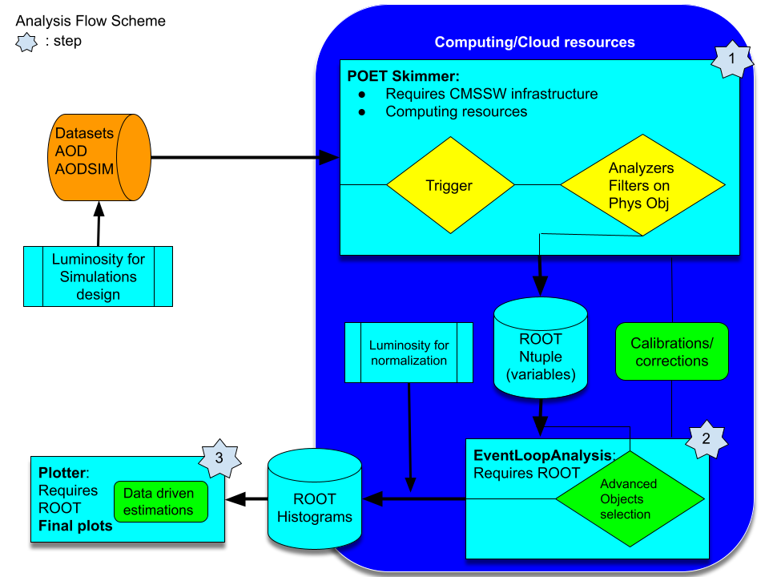

> ## Disclaimer
>
> The first two episodes of this lesson are a demonstration.  You are welcome to follow along, but if at some point you get behind typing, do not worry, you will not be needing this section in order to continue with the hands-on activity after the break.  Of course, later you can refer back to these episodes and/or its video recording.
{: .callout}

## Overview

As you read yesterday, we will try to re-implement the Higgs to ditau analysis that has been already implemented but in a different fashion.  The original open data analysis is based on two Github repositories. The first one is the [AOD2NanoAODOutreachTool](https://github.com/cms-opendata-analyses/AOD2NanoAODOutreachTool) repository.  There, the important piece of code is the [AOD2NanoAOD.cc](https://github.com/cms-opendata-analyses/AOD2NanoAODOutreachTool/blob/master/src/AOD2NanoAOD.cc) code.  This is an analyzer, very similar to the analyzers you saw already in the [POET](https://github.com/cms-legacydata-analyses/PhysObjectExtractorTool) tool.  The main difference is that our POET is capable of extracting the required information in a very modular way.  The second part of this analysis relies on the [HiggsTauTauNanoAODOutreachAnalysis](https://github.com/cms-opendata-analyses/HiggsTauTauNanoAODOutreachAnalysis) repository.  The code in this repository is already independent of CMSSW but relies on `ROOT` libraries, some of which is rather complex for a first approach, like the usage `RDataFrame` class (although powerful).  In summary, one has to compile and run the `skim.cxx` C++ code, then the `histograms.py` python code, and, as a last step, execute the `plot.py` python script.  I.e., this analysis is done in 4 steps.

We will simplify this analysis by performing it in just 3 steps:

1. one to skim our data out of CMSSW infrastructure
1. the second one to analyze the data and produce `ROOT` histograms
1. and the final one to make nice plots.

Later you can refer back to the original open data analysis and compare it to our more orthodox approach.  We hope that adopting this more traditional method, the physics and the logic of it will be clearer.

## Datasets and trigger selection

We will concentrate on studying the decays of a Higgs boson into two tau leptons in the final state of a muon lepton and a hadronically decayed tau lepton.  Since we need to have tau leptons, we choose these two datasets from 2012 (we are going to use only 2012 datasets for simplicity):

* the [Run2012B_TauPlusX](http://opendata.cern.ch/record/6024) dataset and
* the [Run2012C_TauPlusX](http://opendata.web.cern.ch/record/6050) dataset.

Note the sizes of these datasets.  It TBs of data.  No way we can easily download or work locally with them, we would need to *skim* them.

For our background processes we will chose the following MC simulations:

* the [DYJetsToLL](http://opendata.cern.ch/record/7730) dataset, which can contribute with real taus and/or misidentified leptons,
* the [TTbar](http://opendata.cern.ch/record/9518) dataset,
* and the set of [W1JetsToLNu](http://opendata.cern.ch/record/9863), [W2JetsToLNu](http://opendata.web.cern.ch/record/9864), and [W3JetsToLNu](http://opendata.web.cern.ch/record/9865) to complete the W+jets contribution.

As it is commonly done, we would also need to have an idea of how our signal (the process we are trying to find/discover) look like.  Thus, for the Higgs production we will consider the following MC simulations:

* the [GluGluToHToTauTau](http://opendata.cern.ch/record/8001) dataset and
* the [VBF_HToTauTau](http://opendata.cern.ch/record/9743) dataset.

Note also that all these datasets are in the TB range.

Now, for the trigger, we will use the `HLT_IsoMu17_eta2p1_LooseIsoPFTau20` as it is [done](https://github.com/cms-opendata-analyses/HiggsTauTauNanoAODOutreachAnalysis/blob/13b5b3a850b020a19b209d7c8e2df7343cfc5ca0/skim.cxx#L74) in the original open data analysis.  Likewise threr, we will assume that this trigger is *unprescaled*.  Now you know, however, that one should really check that.

## Luminosity calculation

One of the key aspects in any particle physics analysis is the estimation of the integrated luminosity of a given collisions dataset.  From the [original analysis](https://github.com/cms-opendata-analyses/HiggsTauTauNanoAODOutreachAnalysis/blob/13b5b3a850b020a19b209d7c8e2df7343cfc5ca0/skim.cxx#L53) we can see that the full integrated luminosities are:

for a total of approximately 11.5 inverse femtobarns between the two collisions datasets. **But, how can we figure this out?**

Fortunately we have a wonderful tool for this, called `brilcalc`.  Here we show a simple example, but more details can be found in [this CODP guide](http://opendata.cern.ch/docs/cms-guide-luminosity-calculation).

### Installing brilcalc in your container

You can install the `brilcalc` tool in the same cmsopendata container that you have been using so far or even your own host machine.  We will show the example using the container.

* Start your container or create a new one if you wish.  We will create a fresh new one (with our own settings; feel free to change them) that we will use for the rest of this lesson (although you can recycle the one you have been using):

~~~
docker run --name analysisflow -it --net=host --env="DISPLAY" --volume="$HOME/.Xauthority:/root/.Xauthority:rw" --volume="/home/ecarrera/.ssh:/home/cmsusr/.ssh" -v "/home/ecarrera/playground:/playground" cmsopendata/cmssw_5_3_32:latest /bin/bash
~~~
{: .language-bash}

* In order not to pollute the `CMSSW/src` are, we will change to the home directory:

~~~
cd ~
~~~
{: .language-bash}

* Fetch the installer for the brilcalc conda environment:

~~~
wget https://cern.ch/cmslumisw/installers/linux-64/Brilconda-3.0.0-Linux-x86_64.sh
~~~
{: .language-bash}

* Run the installer:

~~~
bash Brilconda-1.1.7-Linux-x86_64.sh -b -p <localbrilcondabase>
~~~
{: .language-bash}
where we substitute `<localbrilcondabase>` with `brilconda`. This is the directory in which the brilcalc tools will be installed.

* Once installed successfully add the tools to your `PATH` with the following command:

~~~
export PATH=$HOME/.local/bin:$HOME/brilconda/bin:$PATH
~~~
{: .language-bash}

* Then install brilcalc with this command:

~~~
pip install brilws
~~~
{: .language-bash}

* Finally check by running the following:

~~~
brilcalc --version
~~~
{: .language-bash}
which should output 3.6.6.

### Lumi calculation example

* Now, as an example, let's calculate the luminosity for the [Run2012B_TauPlusX](http://opendata.cern.ch/record/6024) dataset.  Let's download the list of *validated runs* from this site:

~~~
wget "http://opendata.cern.ch/record/1002/files/Cert_190456-208686_8TeV_22Jan2013ReReco_Collisions12_JSON.txt"
~~~
{: .language-bash}

All collision datasets have been released with a similar file.  Let's explore it:

~~~
less Cert_190456-208686_8TeV_22Jan2013ReReco_Collisions12_JSON.txt
~~~
{: .language-bash}

~~~
{"190645": [[10, 110]], "190646": [[1, 111]], "190659": [[33, 167]], "190679": [[1, 55]], "190688": [[69, 249]], "190702": [[51, 53], [55, 122], [124, 169]], "190703": [[1, 252]], "190704": [[1, 3]], "190705": [[1, 5], [7, 65], [81, 336], [338, 350], [353, 383]], "190706": [[1, 126]], "190707": [[1, 237], [239, 257]], "190708": [[1, 189]], "190733": [[71, 96], [99, 389], [392, 460]], "190736": [[1, 80], [83, 185]], "190738": [[1, 130], [133, 226], [229, 349]], "190782": [[55, 181], [184, 233], [236, 399], [401, 409]], "190895": [[64, 202], [210, 302], [305, 584], [587, 948]], "190906": [[73, 256], [259, 354], [356, 496]], "190945": [[124, 207]], "190949": [[1, 81]], "191043": [[45, 46]], "191046": [[1, 21], [24, 82], [84, 88], [92, 116], [119, 180], [183, 183], [185, 239]], "191056": [[1, 1], [4, 9], [16, 17], [19, 19]], "191057": [[1, 1], [4, 40]], "191062": [[1, 1], [3, 3], [5, 214], ...
~~~
{: .output}

It contains the list of runs and luminosity sections in those runs that have been blessed for quality.

Note that the run range for the `Run2012B_TauPlusX` dataset is from run `193833` to `196531`.

* Obtain the integrated luminosity:

~~~
brilcalc lumi -c web --type pxl -u /pb --begin 193833 --end 196531 -i Cert_190456-208686_8TeV_22Jan2013ReReco_Collisions12_JSON.txt > lumi.log &
~~~
{: .language-bash}

~~~
#Summary:
+-------+------+-------+-------+-------------------+------------------+
| nfill | nrun | nls   | ncms  | totdelivered(/pb) | totrecorded(/pb) |
+-------+------+-------+-------+-------------------+------------------+
| 56    | 146  | 50895 | 50895 | 4493.290785044    | 4411.703590626   |
+-------+------+-------+-------+-------------------+------------------+
#Check JSON:
#(run,ls) in json but not in results: [(190645, 10), (190645, 11), (190645, 12), (190645, 13), (190645, 14), (190645, 15), (190645, 16), (190645, 17), (190645, 18), (19
0645, 19), (190645, 20), (190645, 21), (190645, 22), (190645, 23), (190645, 24), (190645, 25), (190645, 26), (190645, 27), (190645, 28), (190645, 29), (190645, 30), (19
0645, 31), (190645, 32), (190645, 33), (190645, 34), (190645, 35), (190645, 36), (190645, 37), (190645, 38), (190645, 39), (190645, 40), (190645, 41), (190645, 42), (19
0645, 43), (190645, 44), (190645, 45), (190645, 46), (190645, 47), (190645, 48), (190645, 49), (190645, 50), (190645, 51), (190645, 52), (190645, 53), (190645, 54), (19
0645, 55), (190645, 56), (190645, 57), (190645, 58), (190645, 59), (190645, 60), (190645, 61), (190645, 62), (190645, 63), (190645, 64), (190645, 65), (190645, 66), (19
0645, 67), (190645, 68), (190645, 69), (190645, 70), (190645, 71), (190645, 72), (190645, 73), (190645, 74), (190645, 75), (190645, 76), (190645, 77), (190645, 78), (19
0645, 79), (190645, 80), (190645, 81), (190645, 82), (190645, 83), (190645, 84), (190645, 85), (190645, 86), (190645, 87), (190645, 88), (190645, 89), (190645, 90), (19
0645, 91), (190645, 92), (190645, 93), (190645, 94), (190645, 95), (190645, 96), (190645, 97), (190645, 98), (190645, 99), ....
~~~
{: .output}

which is exactly the number quoted in the original analysis.as we will see later.

> Note: You may notice, at the end of the output, luminosity sections that are listed in the json quality file but do not have any luminosity values corresponding to them. These correspond to sections that are left-overs at the end of a run, which where still tagged as STABLE RUN, but actually did not provide any luminosity. These are safe to ignore as they do not contain any events.
{: .testimonial}

## Normalization of MC simulations

Whether it is your signal or background process, when it comes to MC simulations there is a key aspect to take into account.  Given the process cross section, and the integrated luminosity from collisions data, how many events will you have to simulate and/or use in order to make a good comparison with your data?  A key ingredient to answer this question is the scale factor you will have to apply in order to normalize the contribution.

As you may know, the number of events (N) of a given process (with cross section sigma) that are approximately expected to be found in a collisions dataset with integrated luminosity (L) is:

If you happen to simulate Nmc events of a given process with cross section sigma, then to properly normalize this contribution to the known integrated luminosity you need :

 

 I.e., the factor we are looking for is

One should consider this when designing a simulation production (not covered in this workshop but [possible](https://opendata.cern.ch/docs/cms-guide-event-production) with CMS open data infrastructure), and to normalize the simlated datasets already available (we will do this later in the lesson.)


