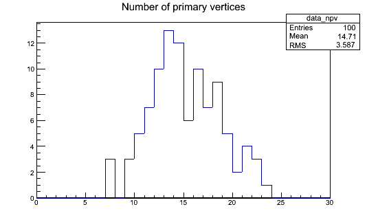

> ## Disclaimer
>
> During the hands-on sessions, there will be less talking from our side and more reading from yours. You should try to follow the instructions below in detail.  If something is not clear, we are here to help.  We will try to silently work on the same exercises as you, so we can keep up with possible questions or discussion.
{: .callout}

## What to do with the skimmed files

Ok, we got these files from [here](https://cernbox.cern.ch/index.php/s/yzj0Qopaxtek5FJ), now what?

- DYJetsToLL.root
- GluGluToHToTauTau.root
- Run2012B_TauPlusX.root
- Run2012C_TauPlusX.root
- TTbar.root
- VBF_HToTauTau.root
- W1JetsToLNu.root
- W2JetsToLNu.root
- W3JetsToLNu.root

Well, we need to do some analysis.  I.e., we would like to apply selection cuts, make some checks maybe (if we were more serious, apply some corrections, calibrations, etc) before selecting some variables of interest and producing histograms.  Just for references, comparing this to the original `RDataFrame` analysis, we would like to apply most of the selection criteria [here](https://github.com/cms-opendata-analyses/HiggsTauTauNanoAODOutreachAnalysis/blob/master/skim.cxx) and [here](https://github.com/cms-opendata-analyses/HiggsTauTauNanoAODOutreachAnalysis/blob/master/histograms.py) so we can later use a modified version of [this](https://github.com/cms-opendata-analyses/HiggsTauTauNanoAODOutreachAnalysis/blob/master/plot.py) python script to make pretty plots.  Of course these is a toy analysis.  If you read the [original publication](http://cms-results.web.cern.ch/cms-results/public-results/publications/HIG-13-004/index.html), it has more selection requirements and include more decay channels.

In order to access the information stored now in the `myoutput.root`-kind of files (remember that they are the output of the POET), we need again some C++ code.  The advantage of these files (over the AOD files before) is that they are essentially flat (we call them *ntuples*), i.e., they do not generally have a crazy/complicated structure like the AOD files (for which you required CMSSW libraries).  They just need `ROOT` libraries to be analyzed.  For this reason, and maybe this is a drawback, you do need `ROOT`.  

Fortunately, you can work in your good old `cmssw-opendata` container (which has an old version of `ROOT`) or you could use a stand-alone `ROOT` container, like it was explained in the prep-work lesson.

We will stick to the `cmssw-opendata` container because we downloaded already the files above.  If you couldn't download them, it is possible to have access remotely, using the `xrootd` protocol, but this will be rather slow unless you are working on a newer `ROOT` stand-alone container. In any case the files are available at `root://eospublic.cern.ch//eos/opendata/cms/upload/od-workshop/ws2021/`

## Getting a code skeleton for analysis

`ROOT` class, `TTree`, has some nice nice methods that can be used to extract a code skeleton.  Let's explore this just a bit and then we will present you with a fully functional template for our analysis.

Let's try to open one of our skimmed files above.  First jump-start your container and/or VM like you usually do (if you continue from the Demo episodo, then you do not have to do anything else):

```bash
docker start -i <name of container>
```

It would be best to move to the `PhysObjectExtractorTool/PhysObjectExtractor/test/` (although this is not required):

```bash
cd PhysObjectExtractorTool/PhysObjectExtractor/test/
```

ROOT-open one of these files:

```bash
root -l Run2012B_TauPlusX.root
```
(or `root -l root://eospublic.cern.ch//eos/opendata/cms/upload/od-workshop/ws2021/Run2012B_TauPlusX.root`, if you are trying to access them remotely)

Let's create a pointer to one of the `Events` tree in one of the directories (let's choose muons), and then execute the `MakeClass()` [method](https://root.cern.ch/doc/master/classTTree.html#ac4ceaf4ae0b87412acf94093043cc2de) to obtain a code skeleton and then exit ROOT.  We are naming the resulting C++ code simply "muons"

~~~
Attaching file Run2012B_TauPlusX.root as _file0...
root [1] TTree* tmuons = (TTree*)_file0->Get("mymuons/Events");
root [2] tmuons->MakeClass("muons")
Info in <TTreePlayer::MakeClass>: Files: muons.h and muons.C generated from TTree: Events
(Int_t)0
root [3] .q
~~~

This will generate a C++ Class with a header file, `muons.h`, and a source file, `muons.C`.  Open these files and explore them quickly, try to make sense of what you see, but do not spend too much time on them. You will find that they are basically an empty skeleton with declarations and definitions that can be used to read the variables stored in our ntuple files, like `Run2012B_TauPlusX.root`.

## Putting it all together a single analysis file

We can put the structure of these two files together and create a single analysis file, which we have call `EventLoopAnalysisTemplate.cxx`.  This example is part of the POET infrastructure and it resides precisely in the directory you are currently at, i.e. `PhysObjectExtractorTool/PhysObjectExtractor/test`. You will probably have to update your repository with `git pull` to get the latest version.  Alternatively, you can download it directly with `wget https://raw.githubusercontent.com/cms-opendata-workshop/workshop2021-payload-analysisflow/master/EventLoopAnalysisTemplate.cxx`

Let's take a look and try to understand briefly how it works.  Take your time and the instructor if there is something not clear.  Then, we will compile and run it.

Open this `EventLoopAnalysisTemplate.cxx` file with an editor or simply look inside with the `less` command.

Since this will run compiled, let's start with the `main` function:

~~~
//-----------------------------------------------------------------
int main()
{
//-----------------------------------------------------------------

  //To be able to read the trigger map
  gROOT->ProcessLine("#include<map>");


  //Compute event weights to be used for the respective datasets
  //const float integratedLuminosity = 4.412 * 1000.0; // Run2012B only
  //const float integratedLuminosity = 7.055 * 1000.0; // Run2012C only
  //const float integratedLuminosity = 11.467 * 1000.0; // Run2012B+C
  //const float mc_w = <xsec> / <#events> * integratedLuminosity;
  const float data_w = 1.0;

  map<string, pair<string,float> > sampleNames;
  //sampleNames.insert(make_pair("MCSample",make_pair("mc",mc_w)));
  sampleNames.insert(make_pair("myoutput",make_pair("data",data_w)));

  //loop over sample files with names  defined above
  for(map< string,pair<string,float> >::iterator it=sampleNames.begin();
      it!=sampleNames.end();it++){

    TString samplename = it->first;
    TString thelabel = it->second.first;
    Float_t sampleweight = it->second.second;

    TStopwatch time;
    time.Start();
    cout << ">>> Processing sample " << samplename <<" with label "<<thelabel<<" and weight "<<sampleweight<<":" <<endl;

    TString filename = samplesBasePath+samplename+".root";

    cout<<"Build the analysis object with file "<<filename<<endl;
    EventLoopAnalysisTemplate mytemplate(filename,thelabel,sampleweight);

    cout<<"Run the event loop"<<endl;
    mytemplate.Loop();
    time.Stop();
    time.Print();
  }

  TFile* hfile = new TFile("histograms.root","RECREATE");

  //Save signal region histos
  data_npv->Write();

  hfile->Close();

  return 0;

}
~~~
{: .language-cpp}

First, there is some loading of a map library happening in `ROOT`.  This is necessary so the trigger information can be read.  Then you will a block which is meant to take care of weights calculations.  Of course, this is to handle simulated datasets.  Besides, we already learned how to calculate luminosities.
Next there is a map which contains the sample name (in the case of this poet example, it is just `myoutput`) and then a pair formed by the dataset *nickname*, in this case `data`, and the weight of this data.  Since these are real collisions, it is set defined as one above.  We could add more samples to our analysis, just by adding entries to our map.

The next block is a loop over the samples in the map.  The main thing to notice is that for each of these hypothetical samples, an `EventLoopAnalysisTemplate` object, called `mytemplate`, is created.  The Class of this object is in its essence the same as the `muon.h` Class we explored above.

~~~
cout<<"Build the analysis object with file "<<filename<<endl;
EventLoopAnalysisTemplate mytemplate(filename,thelabel,sampleweight);
~~~
{: .language-cpp}

Finally, the evet loop is triggered with the `Loop()` method of the object.  

~~~
mytemplate.Loop();
~~~
{: .language-cpp}

It is intuitive to think that the loop is over the *events* in the file.

Finally in the main function, a histogram is saved in a file called `histograms.root`.

Now, let's look at the creation of the `mytemplate` object, which is is the heart of the analysis.  Of course, this object is brought to life by the constructor of the `EventLoopAnalysisTemplate` Class:

~~~
//Constructor of the analysis class
EventLoopAnalysisTemplate::EventLoopAnalysisTemplate(TString thefile, TString thelabel, Float_t sampleweight) : fChain(0)
{
  //Prepare some info for the analysis object:
  filename = thefile;
  labeltag = thelabel;
  theweight = sampleweight;


  //Load histograms easy access
  //hast to be in agreement with above definitions.
  hists[0] = data_npv;

// if parameter tree is not specified (or zero), connect the file
// used to generate this class and read the Tree.
   TTree* tree = 0;
   TFile *f = TFile::Open(filename);
   //trigger should go first as it is the more complicated one
   tree = (TTree*)f->Get("mytriggers/Events");
   //Get trees for friendship
   tevents = (TTree*)f->Get("myevents/Events");
   tvertex = (TTree*)f->Get("mypvertex/Events");
   tmuons = (TTree*)f->Get("mymuons/Events");
   ttaus = (TTree*)f->Get("mytaus/Events");
   tmets = (TTree*)f->Get("mymets/Events");
   //Make friends so we can have access to friends variables
   //we may not use all of the available information
   //it is just an example
   tree->AddFriend(tevents);
   tree->AddFriend(tvertex);
   tree->AddFriend(tmuons);
   tree->AddFriend(ttaus);
   tree->AddFriend(tmets);
   Init(tree);
}
~~~
{: .language-cpp}

The file name of the sample, the nickname of the sample, and the weight are passed to this constructor.  Compare this constructor with the definition of its Class:

~~~
class EventLoopAnalysisTemplate {
public :

  TTree          *fChain;   //!pointer to the analyzed TTree or TChain
  TTree          *ttrigger;
  TTree          *tevents;
  TTree          *tvertex;
  TTree          *tmuons;
  TTree          *ttaus;
  TTree          *tmets;
  Int_t          fCurrent; //!current Tree number in a TChain

  //for managing files and weights
  TString          labeltag;
  TString          filename;
  Float_t          theweight;

  //array to keep histograms to be written and easily loop over them
  TH1F            *hists[nhists];

  // Declaration of example leaf types
  Int_t           run;
  UInt_t          luminosityBlock;
  ULong64_t	   event;
  Int_t           PV_npvs;
  std::map<std::string, int> *triggermap;
  vector<float>   *muon_pt;

  // List of example branches
  TBranch        *b_run;   //!
  TBranch        *b_luminosityBlock;   //!
  TBranch        *b_event;   //!
  TBranch        *b_PV_npvs;   //!
  TBranch        *b_triggermap;   //!
  TBranch        *b_muon_pt;   //!

  EventLoopAnalysisTemplate(TString filename, TString labeltag, Float_t theweight);
  virtual ~EventLoopAnalysisTemplate();
  virtual Int_t    GetEntry(Long64_t entry);
  virtual Long64_t LoadTree(Long64_t entry);
  virtual void     Init(TTree *tree);
  virtual void     Loop();
  virtual Bool_t   Notify();
  virtual void     Show(Long64_t entry = -1);
  void analysis();
  bool MinimalSelection();

};
~~~
{: .language-cpp}

It is evident that what we are doing here is trying to get some of the information (most variables are missing as this is a minimal example) stored in our skimmed files.  Most of the information is set to belong to this class, so as long as your are in its scope, those variables will be available for use.

Note one particular feature in the constructor.  We get several of the `Events` trees in the corresponding directories of the root file from the POET skimmer.  Of course, one can add more information if needed.  The key aspect is to make them these trees friends so the event loop can access all the variables in all the trees.

The last line in the constructor is an `Init` function:

~~~
void EventLoopAnalysisTemplate::Init(TTree *tree)
{
   // The Init() function is called when the selector needs to initialize
   // a new tree or chain. Typically here the branch addresses and branch
   // pointers of the tree will be set.
   // It is normally not necessary to make changes to the generated
   // code, but the routine can be extended by the user if needed.
   // Init() will be called many times when running on PROOF
   // (once per file to be processed).

   // Set object pointer
   //In our case, only vectors and maps
   triggermap =0;
   muon_pt = 0;

   // Set branch addresses and branch pointers
   if (!tree) return;
   fChain = tree;
   fCurrent = -1;
   //Comment out to be able to read map
   //https://root-forum.cern.ch/t/std-map-in-ttree-with-makeclass/14171
   //fChain->SetMakeClass(1);

   fChain->SetBranchAddress("run", &run, &b_run);
   fChain->SetBranchAddress("luminosityBlock", &luminosityBlock, &b_luminosityBlock);
   fChain->SetBranchAddress("event", &event, &b_event);
   fChain->SetBranchAddress("PV_npvs", &PV_npvs, &b_PV_npvs);
   fChain->SetBranchAddress("triggermap",&triggermap,&b_triggermap);
   fChain->SetBranchAddress("muon_pt", &muon_pt, &b_muon_pt);
   Notify();
}
~~~
{: .language-cpp}

This is really where you tell `ROOT` where to look for the information in the analyzed files and where to store it.  For example, you are asking `ROOT`something like: "read the branch (stored in a likewise object `&b_muon_pt`) called `muon_pt` from the current file and store it in my `&muon_pt` vector, which I already and declared and initialized above".  We give identical names following the traditional way in which he `MakeClass()` tool generates the skeletons (as you saw earlier).

You can see at the top that certain variables are defined globally for convenience:

~~~
//const std::string samplesBasePath = "root://eospublic.cern.ch//eos/opendata/cms/upload/od-workshop/ws2021/";
const string samplesBasePath = "";

//book example histograms for specific variables
//copy them in the constructor if you add more
const int nhists = 1;
TH1F* data_npv = new TH1F("data_npv","Number of primary vertices",30,0,30);

//Requiered trigger
const string triggerRequest = "HLT_L2DoubleMu23_NoVertex_v*";
~~~
{: .language-cpp}

Histograms can be easily added there but are always copied to the `hists[]` array of the `EventLoopAnalysisTemplate` Class in order to able to loop over them and make the histogram filling mostly automatic.

Additionally, there are several other methods in the `EventLoopAnalysisTemplate` Class that take care of starting the event loop.  Within the event loop, the `analysis()` method is executed:

~~~
//-----------------------------------------------------------------
void EventLoopAnalysisTemplate::analysis()
{
//-----------------------------------------------------------------

  //cout<<"analysis() execution"<<endl;

  //minimal selection with trigger requirement
  //if (!MinimalSelection()) return;

  //fill histogram
  Int_t histsize = sizeof(hists)/sizeof(hists[0]);
  for (Int_t j=0;j<histsize;++j){

    TString histname = TString(hists[j]->GetName());
    TString thelabel = histname(0,histname.First("_"));
    TString thevar = histname(histname.First("_")+1,histname.Sizeof());

    if (thelabel == labeltag){
      //primary vertices
      if(thevar == "npv"){
	       hists[j]->Fill(PV_npvs,theweight);
      }
    }
  }


}//------analysis()
~~~
{: .language-cpp}

This is where all the action should happen, as you could include selection cuts, like the `MinimalSelection()` example (which is just a simple trigger check), for your analysis.  Mostly-automatic histogram filling, with appropriate weights, also takes place within this function.

Ok, enough of the theory, let's compile.  We can use the compiling line in the header (no need for a Makefile):

```bash
 g++ -std=c++11 -g -O3 -Wall -Wextra -o EventLoopAnalysis EventLoopAnalysisTemplate.cxx $(root-config --cflags --libs)
```

Now we run.  Note that it will run over the `myoutput.root` file that lives in your `PhysObjectExtractorTool/PhysObjectExtractor/test` area.

```bash
./EventLoopAnalysis
```

This will produce a `histograms.root` file, which should contain our `data_npv` histogram. You can open it with `ROOT` and take a look with the [TBrowser](https://cms-opendata-workshop.github.io/workshop2021-lesson-preexercise-cpp-and-root/04-root-and-cpp-fill-a-histogram/index.html#filling-a-histogram):





