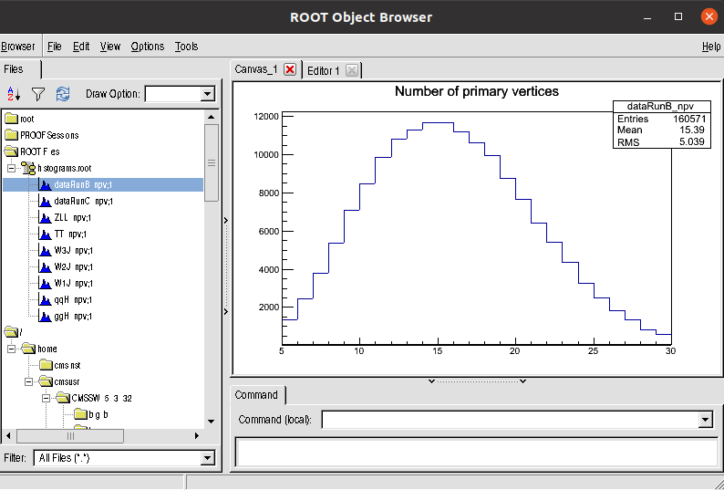
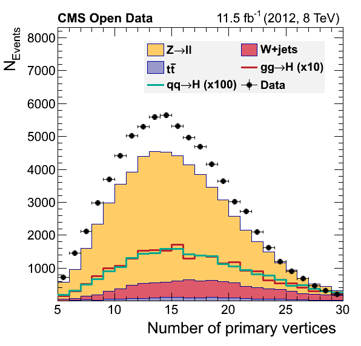
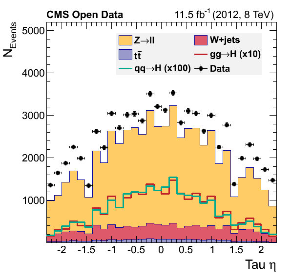
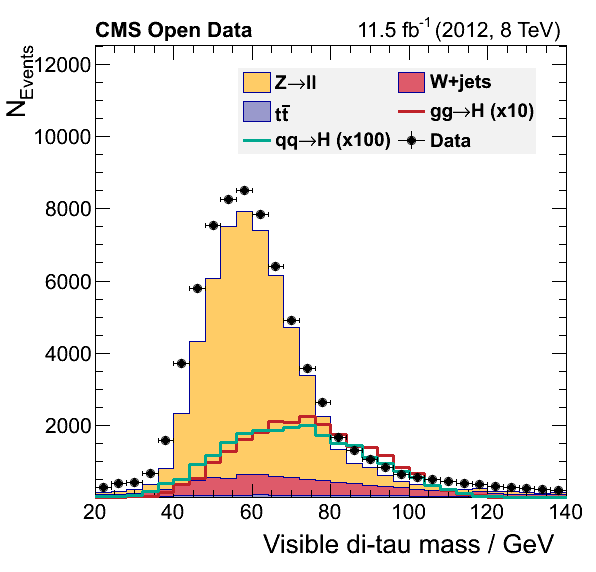

> ## Disclaimer
>
> During the hands-on sessions, there will be less talking from our side and more reading from yours. You should try to follow the instructions below in detail.  If something is not clear, we are here to help.  We will try to silently work on the same exercises as you, so we can keep up with possible questions or discussion.
{: .callout}

## Upgrading the EventLoopAnalysisTemplate

We will try to find Higgses decaying into tau particles in the muon-hadronic channel.  We know we need to run the analysis over several datasets (already skimmed with POET) for collisions, background and signal.

Let's expand our `EventLoopAnalysisTemplate.cxx` to take care of this.  You can download this upgraded file from [here](https://raw.githubusercontent.com/cms-opendata-workshop/workshop2021-payload-analysisflow/master/EventLoopAnalysisTemplate_upgrade.cxx).  Inside the container or VM, where your skimmed data files reside, you can simply do:

```bash
wget https://raw.githubusercontent.com/cms-opendata-workshop/workshop2021-payload-analysisflow/master/EventLoopAnalysisTemplate_upgrade.cxx
```

Take some time to look at this new file.  We have added all the skimmed datasets (which are accessed from the local area) and booked corresponding histograms.  We have also taken the opporunity to add more variable into our code (although we are not using most of them yet).  If you have a wide screen, you can compare it to the previous version using the `sdiff` command of similar:

```bash
sdiff -w180 -b EventLoopAnalysisTemplate.cxx EventLoopAnalysisTemplate_upgrade.cxx |less
```

Nos let's compile it and run:

```bash
g++ -std=c++11 -g -O3 -Wall -Wextra -o EventLoopAnalysis EventLoopAnalysisTemplate_upgrade.cxx $(root-config --cflags --libs)
./EventLoopAnalysis
```

Open the `histogram.root` file.  You will find the `npv` histogram for all the samples:



## EventLoopAnalysis for Higgs to tau tau

Now, as it was our goal, let's try to implement most of the selection criteria used [here](https://github.com/cms-opendata-analyses/HiggsTauTauNanoAODOutreachAnalysis/blob/master/skim.cxx) and [here](https://github.com/cms-opendata-analyses/HiggsTauTauNanoAODOutreachAnalysis/blob/master/histograms.py).

Remember that, at the skimming stage, we already cut rather hard on the requirement to have at least one *good* muon and at least one *good* tau.  The *analysis* version of our `EventLoopAnalysisTemplate` code will, in addition, have:

* A simple selection on the trigger bit that we did not apply earlier
* A cut to select a muon-tau pair from the collections of muons and taus passing the initial selection. The selected pair represents the candidate for this event for a Higgs boson decay to two tau leptons of which one decays to a hadronicfinal state (most likely a combination of pions) and one decays to a muon and a neutrino.
* A muon transverse mass cut for W+jets suppression

Download this code with:

```bash
wget https://raw.githubusercontent.com/cms-opendata-workshop/workshop2021-payload-analysisflow/master/EventLoopAnalysis_noiso.cxx
```
and try to identify the blocks where these selection requirements are applied.

You can compile and run with:

```bash
g++ -std=c++11 -g -O3 -Wall -Wextra -o EventLoopAnalysis EventLoopAnalysis_noiso.cxx $(root-config --cflags --libs) -lGenVector
./EventLoopAnalysis
```

Note the extra flag in the compiler line.

If you check again the histograms file, then you will see that we now have 2 more variables that we will be plotting to try to reproduce the three figures that appear in the [original repository](https://github.com/cms-opendata-analyses/HiggsTauTauNanoAODOutreachAnalysis#analysis-of-higgs-boson-decays-to-two-tau-leptons-using-data-and-simulation-from-the-cms-detector).  

> ## Muon isolation
>
> However, you are missing one important cut: the requirement that the muon, in the muon-tau pair, is isolated.  Based on the [original implementation line](https://github.com/cms-opendata-analyses/HiggsTauTauNanoAODOutreachAnalysis/blob/13b5b3a850b020a19b209d7c8e2df7343cfc5ca0/histograms.py#L118) will you be able to add this cut to our code?  **Try not to look at the solution too soon** and really think about how you will add this cut. (Hint: it is just a single line of code)
>
> > ## solution
> > The answer is as simple as adding the following after the transverse mass cut:
> > ~~~
> > //Require isolated muon for signal region
> >  if (!(muon_pfreliso03all->at(idx_1)<0.1)) return;
> > ~~~
> >
> > You can download the final file with:
> >
> > ```bash
> > wget https://raw.githubusercontent.com/cms-opendata-workshop/workshop2021-payload-analysisflow/master/EventLoopAnalysis.cxx
> > ```
> > {: .language-cpp}
> {: .solution}
{: .challenge}

Let's compile and run once again:

```bash
g++ -std=c++11 -g -O3 -Wall -Wextra -o EventLoopAnalysis EventLoopAnalysis.cxx $(root-config --cflags --libs) -lGenVector
./EventLoopAnalysis
```

If you want you can ispect the `histograms.root` file.

## Making the final plots

One of the reasons why we chose to save the histograms in the way we did was to recycle the `plot.py` pyROOT script from the [original analysis](https://github.com/cms-opendata-analyses/HiggsTauTauNanoAODOutreachAnalysis/blob/master/plot.py).  It needs some touches to make it work in our older version of `ROOT`, but it is essentially the same.  It is mostly a bunch of `pyROOT` statements to make pretty plots.  You could skim through it in order to grasp some understanding of how it works.

You can get a preliminary/compatible version of thi script, `plot_nocr.py`, with:

```bash
wget https://raw.githubusercontent.com/cms-opendata-workshop/workshop2021-payload-analysisflow/master/plot_nocr.py
```

Now, run it:

```bash
python plot_nocr.py
```

If everything went alright you musta have obtained these figures:





> ## What happened?
>
> Did we discover something? Or did we forget some background process?
> You will try to fix this during the **offline challenge**.
{: .discussion}


