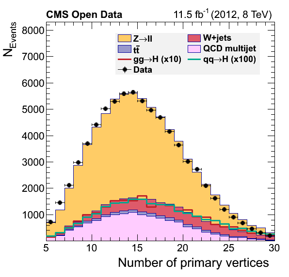
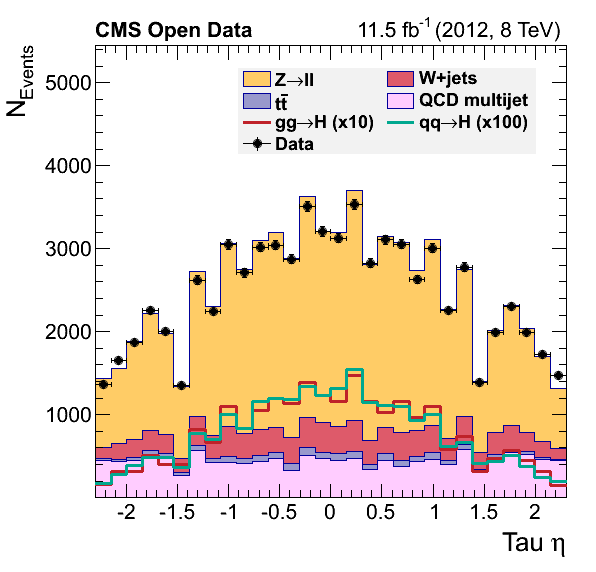
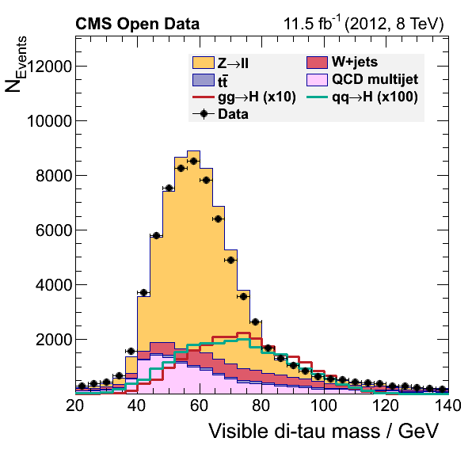

## Data-driven QCD estimation

[These comments](https://github.com/cms-opendata-analyses/HiggsTauTauNanoAODOutreachAnalysis/blob/master/plot.py#:~:text=The%20major%20part,a%20scale%20factor.) in the original `plot.py` script, assert the possibility of estimating the `QCD` contribution in our analysis.

To give you a head-start, [this version](https://raw.githubusercontent.com/cms-opendata-workshop/workshop2021-payload-analysisflow/master/plot.py) of the `plot.py` will work with the output of the final version of our `EventLoopAnalysis.cxx` code.  Your task consists of modifying the latter code so we can complete the final plots by adding the QCD background.

Final plots should look like:


