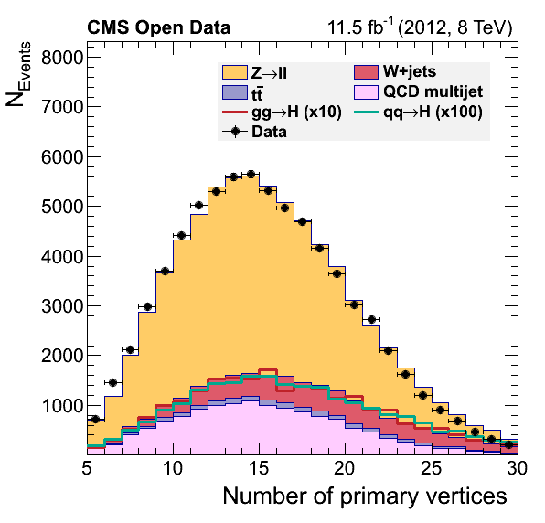
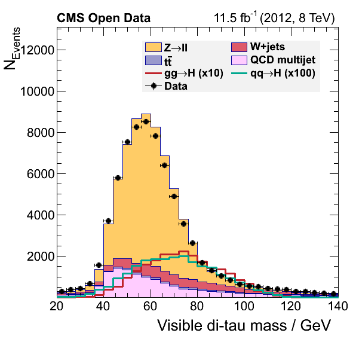

## The solution

[Here](https://github.com/cms-opendata-workshop/workshop2021-payload-analysisflow/blob/master/EventLoopAnalysis_solution.cxx) is the solution to yesterday's adventure.  Let's go through it.

## The difference in our plots

Did you notice a difference between our final plots below and the ones from our [reference](https://github.com/cms-opendata-analyses/HiggsTauTauNanoAODOutreachAnalysis#analysis-of-higgs-boson-decays-to-two-tau-leptons-using-data-and-simulation-from-the-cms-detector)?  What would it take to make a closer replica?

  <table align="center">
    <tr>
      <th></th>
      <th></th>
    </tr>  
</table>

<table align="center">
    <tr>
      <th></th>
      <th></th>
    </tr>  
</table>

<table align="center">
    <tr>
      <th></th>
      <th></th>
    </tr>  
</table>


